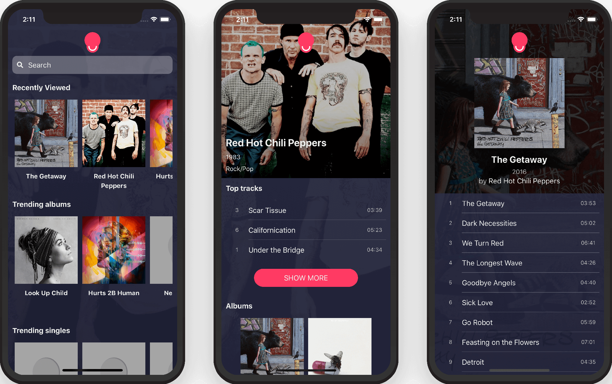

<div align="center">
	<a href="https://chrisvltn.github.io/music-db">
		
	</a>
</div>

# [Music DB]

*A music library interface using React in front-end and [The Audio DB's API] as back-end*

## [Live]

[](https://chrisvltn.github.io/music-db)

## Installation

### `Step 1` - clone the repo

```bash
$ git clone https://github.com/chrisvltn/music-db.git
```

### `Step 2` - cd in the repo

```bash
$ cd music-db
```

### `Step 3` - install dependencies

```bash
$ npm install
```

### `Step 4` - run application

```bash
$ npm start
```

In browser, open http://localhost:3000

## Testing

```bash
$ npm run test
```

## Deployment

```bash
$ npm run deploy
```

## Built with

- [x] - [React]
- [x] - [Typescript]
- [x] - [CSS in JS]
- [x] - [LocalForage]

## Main Features

- [x] - Search artist
- [x] - Albums list
- [x] - Recently viewed artists and albums
- [x] - Trending albums and singles

----------------------------------------------

- [x] - Service Worker
- [x] - Browser database
- [x] - Add to Home Screen, Splash Screen, Standalone Mode
- [x] - Offline Cache Support
- [x] - Background Sync

#### License

MIT © [chrisvltn]

[Music DB]: https://chrisvltn.github.io/music-db
[Live]: https://chrisvltn.github.io/music-db
[The Audio DB's API]: https://chrisvltn.github.io/music-db
[React]: https://reactjs.org/
[Typescript]: https://www.typescriptlang.org/
[CSS in JS]: https://cssinjs.org/
[LocalForage]: https://localforage.github.io/localForage/
[chrisvltn]: https://github.com/chrisvltn
